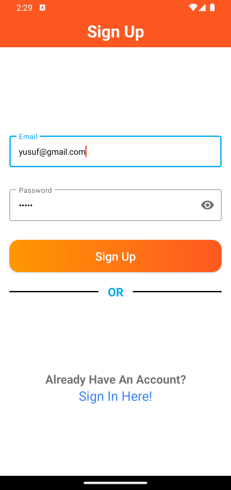
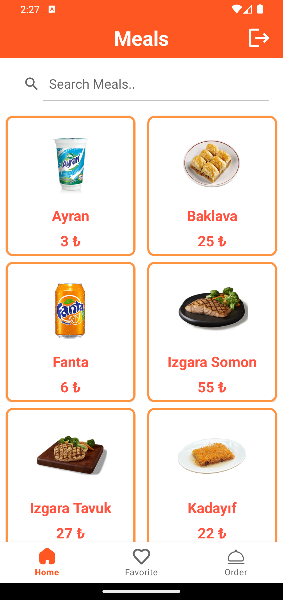
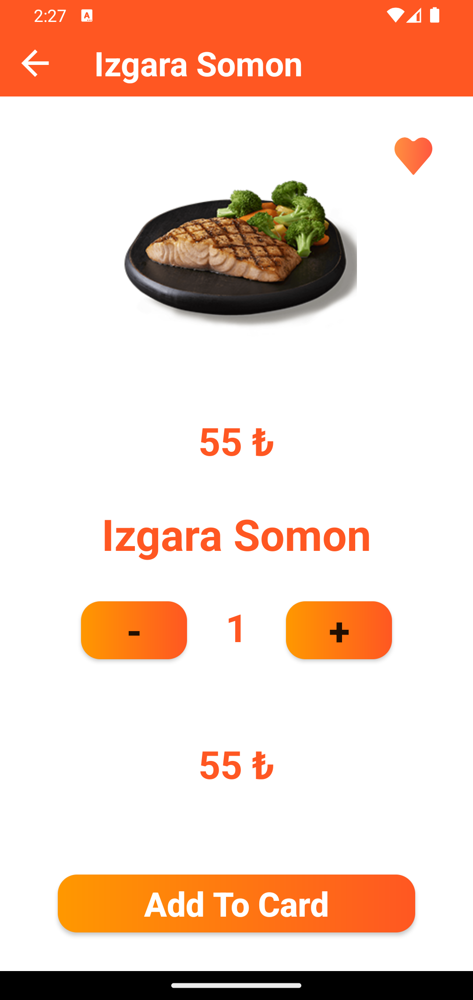
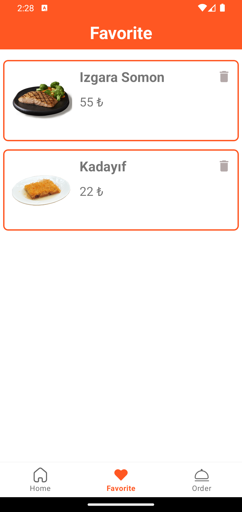
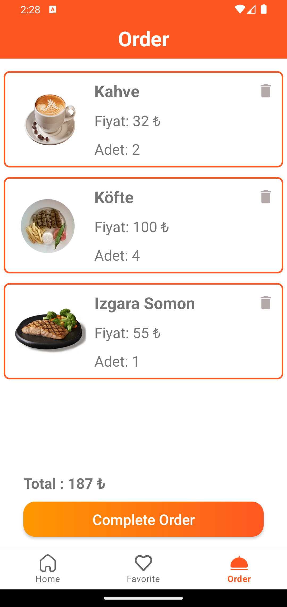

# Bootcamp Meal App
This application was made in accordance with the modern application development architecture and clean architecture for Kasım Adalan's bootcamp graduation project.
# Tech Stack
- MVVM
- Retrofit
- Firebase
- DI - Hilt
- Jetpack Navigation
- Flow
- Custom View
- Use Case
- Lottie Animation
## 📸Screenshots
&nbsp; &nbsp; &nbsp;
&nbsp; 
